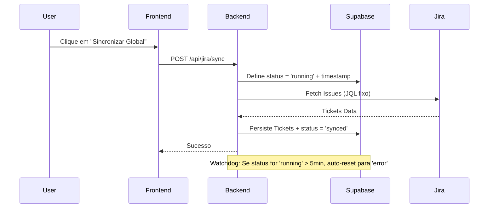

# 🏛️ Arquitetura do Sistema - Jira Dashboard

Este documento detalha as decisões arquiteturais, fluxos de dados e padrões técnicos adotados no projeto.

---

## 1. Visão Geral da Arquitetura

O sistema utiliza uma arquitetura baseada em **Camadas de Serviço** com persistência centralizada no **Supabase**.

### Componentes:
1.  **Frontend (Vanilla JS)**: Consome APIs serverless e renderiza componentes baseados em estado.
2.  **Backend (Express / Node.js)**: Orquestra a integração com Jira e gerencia a criptografia.
3.  **Supabase**: Atua como o "Single Source of Truth", armazenando configurações e o estado global da sincronização.
4.  **Jira Cloud**: Fonte primária dos dados de tickets e projetos.

---

## 2. Fluxo de Sincronização e Watchdog

Para resolver o problema de estados "presos" em sincronização, foi implementado um sistema de Watchdog:

---

## 3. Segurança e Proteção de Dados

### Criptografia de Credenciais
*   **Algoritmo**: `aes-256-cbc`.
*   **Chave**: Armazenada na variável de ambiente `JIRA_ENCRYPTION_KEY` (mínimo 32 bytes).
*   **Processo**: O token da API do Jira nunca é retornado ao frontend em texto puro. O backend descriptografa apenas no momento da requisição ao Jira.

### Isolamento (JQL)
O filtro JQL é mantido no backend ou configurado via Supabase, impedindo que usuários finais alterem o escopo de visualização dos projetos sem permissão administrativa.

---

## 4. Auditoria de Saúde de Dados (Data Health)

O sistema de auditoria foi projetado para garantir que o dashboard reflita a realidade da operação. As regras de inconsistência são:

| Regra | Critério | Ação do Auditor |
|-------|----------|-----------------|
| **Sem Analista** | `assignee` está vazio | Lista como Erro Crítico |
| **Sem Prazo** | `due_date` está vazio | Alerta de "Sem Data" |
| **Sem Prioridade** | `priority` está nulo | Marca como Inconsistente |
| **Preso em Fluxo** | `status` em progresso e `assignee` nulo | Alerta de "Bloqueado" |

---

## 5. Padrões de Código e Manutenção

*   **Service Pattern**: Lógica de negócio isolada em `ConfigService` e `JiraService`.
*   **Singleton State**: O `DataService` no frontend garante que as métricas sejam calculadas uma única vez por carregamento.
*   **Design Tokens**: Uso extensivo de variáveis CSS para manter a consistência visual em todo o sistema.

---

## 6. Persistência (Supabase Schema)

### Tabela: `jira_connections`
Armazena as configurações de acesso (Base URL, Email, Token Criptografado).

### Tabela: `jira_sync_status`
Armazena o estado atual da sincronização global (`status`, `last_sync`, `error_message`).

### Tabela: `jira_issues`
Cache dos dados normalizados para visualização rápida no Dashboard e Kanban.

---

**Arquitetura mantida sob os princípios de escalabilidade e segurança da Antlia Dev.**
